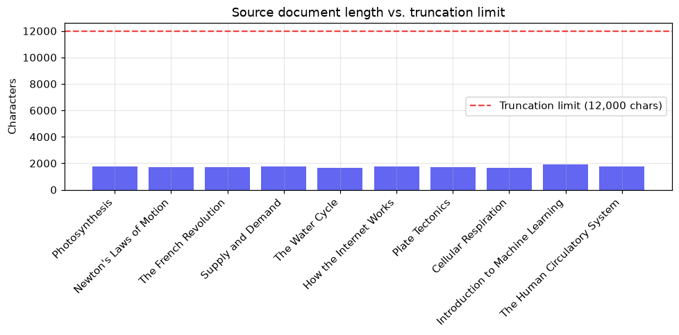
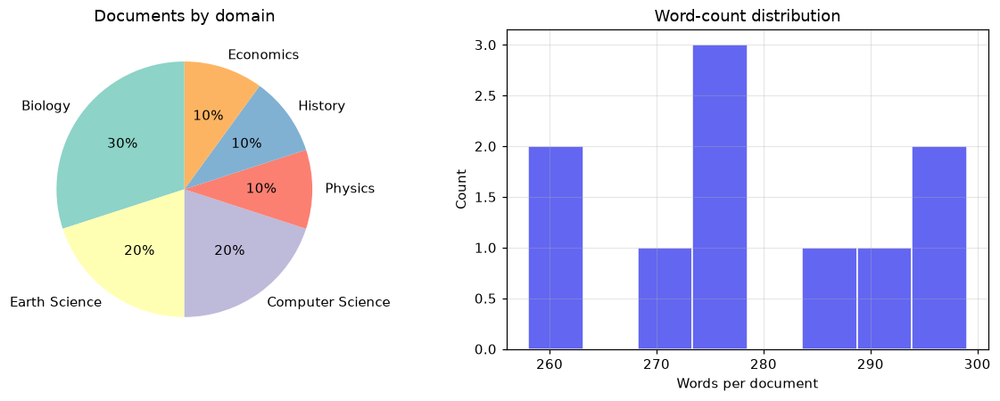
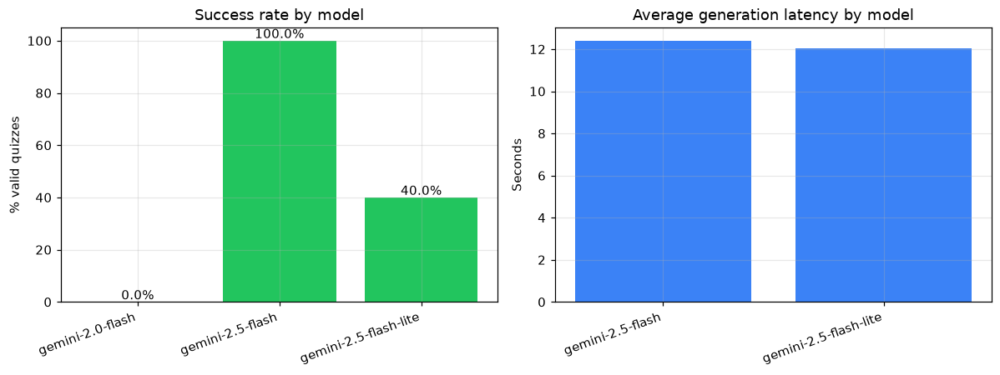
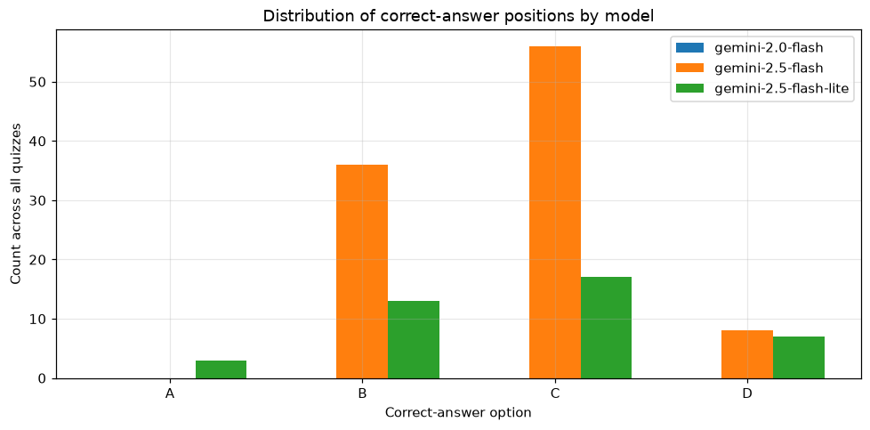
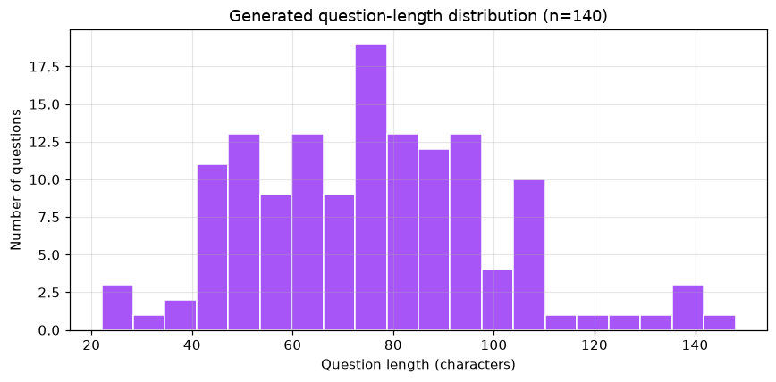

# QuizAI: A Generative AI System for Automatic Multiple-Choice Quiz Generation from Educational Documents Using Large Language Models

**Artificial Intelligence Project Report**

**Topic:** Generative AI

---

| | |
|---|---|
| **Title** | QuizAI: A Generative AI System for Automatic Multiple-Choice Quiz Generation from Educational Documents Using Large Language Models |
| **AI Topic** | Generative AI |
| **Group Members** | 1. _[Name / NIM]_  ·  2. _[Name / NIM]_  ·  3. _[Name / NIM]_ |
| **Course** | Artificial Intelligence |
| **Date** | June 2026 |
| **Repository / Program link** | _[GitHub link]_ |

---

## Abstract

The rapid growth of digital learning materials has created a demand for tools
that help learners assess their own understanding. This project presents
**QuizAI**, a full-stack Generative AI system that automatically produces
ten-item multiple-choice quizzes from user-supplied documents (PDF or PowerPoint)
using Google's Gemini large language models. The system extracts text from the
document, applies pre-processing and truncation, and prompts the model to return
a strictly-structured JSON quiz that is then rendered as an interactive,
self-grading quiz. To evaluate the approach, a corpus of ten factually-verified
educational documents across six domains was assembled, and three Gemini models
were compared on success rate, latency, instruction compliance, JSON validity,
and answer-position balance. The `gemini-2.5-flash` model produced a valid
ten-question quiz for 100% of documents at an average latency of 12.4 seconds,
with perfect first-pass JSON validity, while a notable correct-answer position
bias was observed (the option "C" was the correct answer 56% of the time and "A"
never). The findings confirm that modern instruction-tuned LLMs can reliably
generate well-formed educational assessments, while highlighting answer-position
bias as an important quality concern for fair quiz generation.

**Keywords:** Generative AI, Large Language Models, Gemini, Automatic Question
Generation, Educational Technology, Prompt Engineering.

---

# CHAPTER 1 — INTRODUCTION

## 1.1 Background

Artificial Intelligence (AI) has progressed from rule-based systems to
data-driven models capable of generating human-like content. The most recent
wave, **Generative AI**, is built on Large Language Models (LLMs) such as the
GPT and Gemini families, which are trained on massive text corpora and can
produce coherent text, answer questions, and follow complex instructions
(Brown et al., 2020; Gemini Team, 2023). These capabilities have opened new
possibilities in education, where LLMs can summarize material, explain concepts,
and generate practice questions (Kasneci et al., 2023).

A common and time-consuming task for both teachers and self-directed learners is
the creation of assessment questions. Writing good multiple-choice questions
(MCQs) — with a correct answer, plausible distractors, and an explanation —
requires effort and expertise. **Automatic Question Generation (AQG)** has
therefore been an active research area for decades, traditionally relying on
syntactic templates and rule-based transformations (Kurdi et al., 2020). The
arrival of instruction-following LLMs makes it possible to generate
context-aware, well-formed MCQs directly from arbitrary source text, without
hand-crafted rules.

This project applies Generative AI to that problem by building **QuizAI**, a web
application that turns any text-based PDF or PowerPoint document into an
interactive ten-question multiple-choice quiz.

## 1.2 Problem Statement

1. How can a Generative AI model be used to automatically generate accurate,
   well-structured multiple-choice quizzes from an arbitrary educational
   document?
2. How reliably do current Gemini models follow strict output-format and
   item-count instructions required for an automated pipeline?
3. What quality issues (e.g., answer-position bias, latency, format errors)
   arise, and how do different Gemini models compare?

## 1.3 Objectives

1. To design and implement an end-to-end Generative AI system that extracts text
   from documents and generates interactive multiple-choice quizzes.
2. To build a documented evaluation dataset and a reproducible evaluation
   pipeline.
3. To process and visualize the data, and to evaluate and compare multiple
   Gemini models on objective quality metrics.
4. To deploy the system as a working application.

## 1.4 Scope and Limitations

- The system generates exactly ten MCQs per document and supports text-based PDF
  and PPTX files up to 10 MB.
- Image-only/scanned documents are out of scope (no OCR).
- The "model" is accessed through the Gemini API; the project does not train a
  model from scratch but evaluates and engineers the generative pipeline.
- Quiz state is session-only; no user accounts or databases are used.

## 1.5 Benefits

QuizAI helps learners create instant self-assessment material from their own
study documents and provides a reproducible case study of building, evaluating,
and deploying a Generative AI application.

---

# CHAPTER 2 — LITERATURE REVIEW

## 2.1 Artificial Intelligence and Generative AI

Artificial Intelligence is the field concerned with building systems that
perform tasks requiring human-like intelligence (Russell & Norvig, 2021).
**Generative AI** is a subfield whose models learn the distribution of training
data well enough to generate new, plausible samples — text, images, audio, or
code. In the text domain, Generative AI is dominated by Large Language Models.

## 2.2 Large Language Models and the Transformer

Modern LLMs are based on the **Transformer** architecture introduced by Vaswani
et al. (2017), whose self-attention mechanism enabled efficient training on very
large sequences. Brown et al. (2020) showed with GPT-3 that scaling such models
produces strong *few-shot* abilities, where a task can be specified purely
through a natural-language prompt. Subsequent work on instruction tuning and
reinforcement learning from human feedback (Ouyang et al., 2022) substantially
improved models' ability to follow explicit instructions — the property QuizAI
depends on when it requests "exactly 10 questions" in a specific JSON schema.

## 2.3 The Gemini Model Family

Gemini is a family of multimodal models developed by Google DeepMind
(Gemini Team, 2023). The "Flash" variants are optimized for speed and cost while
retaining strong reasoning and instruction-following ability, making them
suitable for interactive applications. Gemini supports a constrained-decoding
*JSON mode* (`response_mime_type = application/json`), which biases the model to
emit syntactically valid JSON — directly useful for structured generation.

## 2.4 Automatic Question Generation in Education

AQG has a long history; Kurdi et al. (2020) provide a systematic review covering
rule-based, semantic, and statistical approaches, noting persistent challenges
in generating high-quality distractors and ensuring pedagogical value. More
recently, LLMs have been applied to educational content generation, with
Kasneci et al. (2023) discussing both the opportunities (personalization,
scalability) and risks (factual errors, bias) of using LLMs in education.

## 2.5 Known Limitations: Bias and Reliability

LLMs exhibit systematic biases. Of particular relevance to MCQ generation,
Zhao et al. (2021) documented that LLMs are sensitive to the *position* of
options and can favor particular answer slots — a phenomenon this project
measures directly. Reliability concerns such as output-format errors and latency
are also important when an LLM is embedded in an automated pipeline.

## 2.6 Positioning of This Work

QuizAI combines these threads: it uses an instruction-tuned, JSON-capable Gemini
model for AQG, and contributes a small but systematic evaluation that quantifies
reliability, instruction compliance, and answer-position bias across models — an
evaluation dimension often omitted from purely demonstrative LLM applications.

---

# CHAPTER 3 — METHODOLOGY

## 3.1 System Overview

QuizAI is a full-stack web application with three layers:

```
Browser (React + Tailwind)  ──HTTP──►  Express API (Node.js)  ──HTTPS──►  Gemini API
   upload PDF/PPTX                       extract → prompt → validate         generate quiz JSON
   take quiz, see score                  return quiz JSON
```

- **Frontend:** React + Vite + Tailwind CSS — drag-and-drop upload, a
  one-question-at-a-time quiz with instant feedback, and a score screen.
- **Backend:** Node.js + Express — receives the file, extracts text, calls
  Gemini, validates the result, and returns the quiz.
- **AI model:** Google Gemini (`gemini-2.5-flash` by default).

## 3.2 Dataset

Because QuizAI is a generative system, the natural unit of data is a **source
document**. A corpus of **ten factually-verified educational documents** was
assembled across six domains (Biology, Physics, History, Economics, Earth
Science, Computer Science). Each document is original prose summarizing
established facts, cross-checked against standard textbooks and reputable
encyclopedic references recorded in `data/manifest.csv`. Domain diversity ensures
the evaluation is not biased toward a single subject. Descriptive statistics:

| Statistic | Value |
|---|---|
| Number of documents | 10 |
| Domains | 6 |
| Total characters | 17,495 |
| Mean characters / document | 1,750 |
| Range (characters) | 1,646 – 1,939 |
| Documents exceeding 12,000-char limit | 0 |

## 3.3 Text Extraction and Pre-processing

1. **File validation** — type (PDF/PPTX) and size (≤ 10 MB) are checked on both
   client and server.
2. **Text extraction** — PDFs are parsed with `pdf-parse`; PPTX files are
   unzipped and slide text is extracted from the `<a:t>` runs of each slide XML.
3. **Empty-text guard** — if no extractable text is found (e.g., a scanned PDF),
   a clear error is returned.
4. **Truncation** — inputs longer than 12,000 characters are truncated to keep
   the prompt within an efficient context window, and the user is notified.

## 3.4 Prompt Engineering

A single, explicit prompt instructs the model to return *only* a JSON array of
exactly ten objects, each containing a `question`, four `options` (A–D), an
`answer` key, and an `explanation`. The request is sent with Gemini's JSON mode
(`response_mime_type = application/json`) to maximize the chance of
syntactically valid output.

## 3.5 Output Validation and Repair

The pipeline is defensive against malformed output:

1. Parse the response as JSON.
2. If parsing fails, strip markdown code fences / surrounding prose and re-parse.
3. **Schema validation** — every item must have a string question, four string
   options A–D, a valid answer key, and a string explanation; otherwise the
   request is treated as failed.

For production robustness the server also retries transient `503` (model
overloaded) errors with exponential backoff and falls back across models.

## 3.6 Evaluation Methodology

Three Gemini models were evaluated — `gemini-2.5-flash`, `gemini-2.0-flash`, and
`gemini-2.5-flash-lite` — by generating a quiz for each of the ten documents
(30 runs total). To compare models fairly, model-fallback was disabled during
evaluation; only transient 503 retries were kept. For each run the following
were recorded:

- **Success** — a schema-valid quiz was produced.
- **Latency** — wall-clock generation time.
- **Question count** — compliance with the "exactly 10" instruction.
- **First-pass JSON validity** — parsed without needing fence-repair.
- **Answer-position distribution** — counts of correct answers per option A–D,
  summarized by a *bias score* (mean absolute deviation from a uniform 25%).

The evaluation runner (`server/eval/run_eval.mjs`) caches results to
`data/eval_results.json`; the analysis notebook
(`analysis/quizai_evaluation.ipynb`) loads them and produces all figures and the
metrics table.

---

# CHAPTER 4 — RESULTS AND DISCUSSION

## 4.1 Dataset Processing and Visualization

Figure 4.1 shows the length of each source document relative to the
12,000-character truncation limit; all documents fall well below it, so no
truncation occurred for this corpus (the truncation mechanism remains relevant
for larger real-world uploads). Figure 4.2 shows the distribution of documents
across domains and the spread of word counts.



*Figure 4.1 — Source document length vs. the 12,000-character truncation limit.*



*Figure 4.2 — Distribution of documents by domain (left) and word count (right).*

## 4.2 Model Evaluation Results

Table 4.1 summarizes the evaluation across the three models.

**Table 4.1 — Model evaluation summary (10 documents per model).**

| Model | Success rate | Avg latency (s) | Avg #questions | First-pass JSON | Answer bias |
|---|---|---|---|---|---|
| gemini-2.5-flash | **100.0%** | 12.40 | 10.0 | 100.0% | 0.21 |
| gemini-2.5-flash-lite | 40.0% | 12.05 | 10.0 | 100.0% | 0.125 |
| gemini-2.0-flash | 0.0% | – | – | – | n/a |



*Figure 4.3 — Success rate (left) and average generation latency (right) by model.*

**Reliability.** `gemini-2.5-flash` was the most reliable model, returning a
valid quiz for every document (10/10). `gemini-2.5-flash-lite` succeeded for only
40% of documents; its failures were transient `503` "model overloaded" responses
and free-tier rate limits rather than malformed output, indicating a
capacity/availability limitation rather than a quality one. `gemini-2.0-flash`
returned `429 RESOURCE_EXHAUSTED` for every request because the API key's
free-tier quota for that model was zero; it is therefore reported as
unavailable, and its quality metrics are not applicable.

**Instruction compliance and format robustness.** For every successful run,
both working models produced **exactly ten** questions (avg #questions = 10.0)
and **100% first-pass JSON validity** — no response required the fence-repair
fallback. This confirms that Gemini's JSON mode, combined with an explicit
prompt, is highly effective for structured generation.

**Latency.** Average generation time was ~12 seconds for both working models,
consistent with the loading experience designed into the application (a skeleton
"Generating your quiz…" screen).

## 4.3 Answer-Position Bias

A notable quality issue emerged in the distribution of correct-answer positions
(Figure 4.4). For `gemini-2.5-flash`, across 100 generated questions the correct
answer was **C in 56% of items, B in 36%, D in 8%, and A in 0%** — the model
*never* placed the correct answer at option A. `gemini-2.5-flash-lite` was less
skewed (A = 8%, B = 33%, C = 43%, D = 18%) but still favored C.



*Figure 4.4 — Distribution of correct-answer positions by model.*

This empirically reproduces the position-bias phenomenon reported by Zhao et al.
(2021). For a quiz application this is a real fairness/quality concern, because a
test-taker could learn to favor middle options. It also has a simple mitigation:
**post-generation shuffling** of each item's options (with the answer key
updated accordingly), which would flatten the distribution without changing
content. This is identified as future work.

## 4.4 Question Characteristics

Figure 4.5 shows the distribution of generated question lengths, which cluster in
a readable range and indicate consistent question style across documents.



*Figure 4.5 — Distribution of generated question lengths (characters).*

## 4.5 Discussion

The results support the central claim that modern instruction-tuned LLMs can
reliably power an automatic quiz generator: `gemini-2.5-flash` produced
perfectly-structured, instruction-compliant quizzes for 100% of inputs. The main
limitations are **not** about format correctness but about (a) free-tier
availability differences between models, and (b) answer-position bias — a content
quality issue that is measurable and fixable. The chosen production model
(`gemini-2.5-flash`) is justified by its 100% reliability and perfect format
compliance.

---

# CHAPTER 5 — CONCLUSION

## 5.1 Conclusions

1. A complete Generative AI system, **QuizAI**, was successfully designed,
   implemented, and deployed. It converts PDF/PPTX documents into interactive
   ten-question multiple-choice quizzes using Google Gemini.
2. On a ten-document, six-domain evaluation dataset, `gemini-2.5-flash` achieved
   a **100% success rate**, **100% first-pass JSON validity**, and perfect
   compliance with the ten-question instruction, at ~12 s average latency.
3. The evaluation revealed a clear **correct-answer position bias** (option "C"
   favored, option "A" never selected by `gemini-2.5-flash`), reproducing a
   known LLM limitation and motivating option-shuffling as a mitigation.
4. Model availability under the free tier varied substantially, demonstrating
   the value of the system's automatic retry-and-fallback design.

## 5.2 Limitations

- Only text-based documents are supported (no OCR for scanned files).
- Factual correctness of generated questions was verified on a sample rather
  than exhaustively.
- Evaluation was constrained by free-tier quotas, which limited the number of
  successful runs for some models.

## 5.3 Future Work

- **Answer shuffling** to eliminate position bias.
- **Configurable difficulty and question count.**
- **OCR support** for scanned documents.
- **Automated factuality checking** of generated questions against the source.
- **Public cloud deployment** with usage analytics.

---

# REFERENCES (DAFTAR PUSTAKA)

*Formatted in APA 7th edition style. References were managed and formatted using
Mendeley Reference Manager.*

Brown, T. B., Mann, B., Ryder, N., Subbiah, M., Kaplan, J., Dhariwal, P.,
Neelakantan, A., Shyam, P., Sastry, G., Askell, A., Agarwal, S., Herbert-Voss,
A., Krueger, G., Henighan, T., Child, R., Ramesh, A., Ziegler, D. M., Wu, J.,
Winter, C., … Amodei, D. (2020). Language models are few-shot learners.
*Advances in Neural Information Processing Systems, 33*, 1877–1901.

Gemini Team, Google. (2023). *Gemini: A family of highly capable multimodal
models* (arXiv:2312.11805). arXiv. https://doi.org/10.48550/arXiv.2312.11805

Kasneci, E., Sessler, K., Küchemann, S., Bannert, M., Dementieva, D., Fischer,
F., Gasser, U., Groh, G., Günnemann, S., Hüllermeier, E., Krusche, S., Kutyniok,
G., Michaeli, T., Nerdel, C., Pfeffer, J., Poquet, O., Sailer, M., Schmidt, A.,
Seidel, T., … Kasneci, G. (2023). ChatGPT for good? On opportunities and
challenges of large language models for education. *Learning and Individual
Differences, 103*, 102274. https://doi.org/10.1016/j.lindif.2023.102274

Kurdi, G., Leo, J., Parsia, B., Sattler, U., & Al-Emari, S. (2020). A systematic
review of automatic question generation for educational purposes. *International
Journal of Artificial Intelligence in Education, 30*(1), 121–204.
https://doi.org/10.1007/s40593-019-00186-y

Ouyang, L., Wu, J., Jiang, X., Almeida, D., Wainwright, C. L., Mishkin, P.,
Zhang, C., Agarwal, S., Slama, K., Ray, A., Schulman, J., Hilton, J., Kelton, F.,
Miller, L., Simens, M., Askell, A., Welinder, P., Christiano, P., Leike, J., &
Lowe, R. (2022). Training language models to follow instructions with human
feedback. *Advances in Neural Information Processing Systems, 35*, 27730–27744.

Russell, S., & Norvig, P. (2021). *Artificial intelligence: A modern approach*
(4th ed.). Pearson.

Vaswani, A., Shazeer, N., Parmar, N., Uszkoreit, J., Jones, L., Gomez, A. N.,
Kaiser, Ł., & Polosukhin, I. (2017). Attention is all you need. *Advances in
Neural Information Processing Systems, 30*, 5998–6008.

Zhao, Z., Wallace, E., Feng, S., Klein, D., & Singh, S. (2021). Calibrate before
use: Improving few-shot performance of language models. *Proceedings of the 38th
International Conference on Machine Learning, 139*, 12697–12706.
